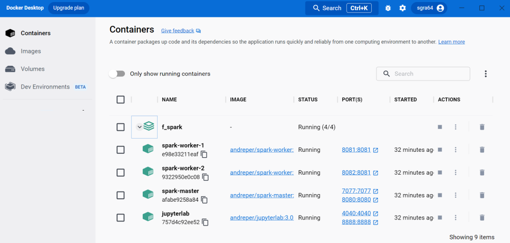
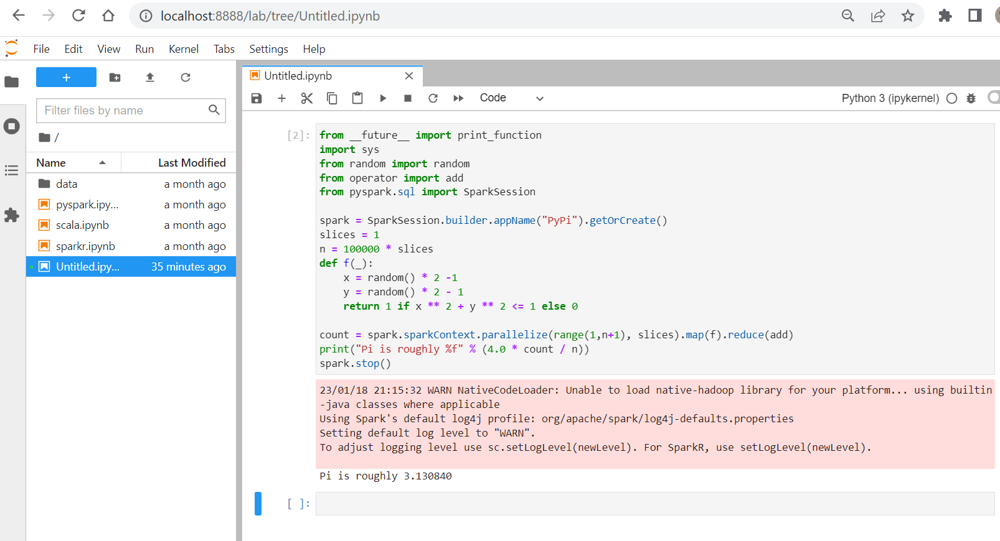

# Assignment F: PySpark &nbsp; (<span style="color:red">12 Pts</span>)

Apache Spark is an open-source unified analytics engine for large-scale data processing. Spark provides an interface for programming clusters with:

- implicit data parallelism and

- fault tolerance.


&nbsp;

---

### Challenges
1. [Challenge 1:](#1-challenge-1-get-pyspark-containers) Get PySpark Containers - (2 Pts)
1. [Challenge 2:](#2-challenge-2-set-up-simple-pyspark-program) Set-up simple PySpark Program - (2 Pts)
1. [Challenge 3:](#3-challenge-3-run-on-pyspark-cluster) Run on PySpark Cluster - (2 Pts)
1. [Challenge 4:](#4-challenge-4-explain-the-program) Explain the Program - (2 Pts)
1. [Challenge 5:](#5-challenge-5-solve-the-shakespeare-challenge) Solve the Shakespeare Challenge - (4 Pts)


&nbsp;

---

### 1.) Challenge 1: Get PySpark Containers

Setup PySpark as Spark Standalone Cluster with Docker:

[https://github.com/cluster-apps-on-docker/spark-standalone-cluster-on-docker](https://github.com/cluster-apps-on-docker/spark-standalone-cluster-on-docker)

The setup looks like this:


One simple command will:

- fetch all needed Docker images (~1.5GB).

- create containers for: Spark-Master, 2 Worker-Processes, Jupyter-Server.

- lauch all containers at once.

Clone the project and use as project directory:

```
git clone https://github.com/cluster-apps-on-docker/spark-standalone-cluster-on-docker
```

Fetch images, create and launch all containers with one command:
```
docker-compose up
```

It will launch the following containers:



Open Urls:

<table>
<thead>
<tr>
<th>Application</th>
<th>URL</th>
<th>Description</th>
</tr>
</thead>
<tbody>
<tr>
<td>JupyterLab</td>
<td><a href="http://localhost:8888/" rel="nofollow">localhost:8888</a></td>
<td>Cluster interface with built-in Jupyter notebooks</td>
</tr>
<tr>
<td>Spark Driver</td>
<td><a href="http://localhost:4040/" rel="nofollow">localhost:4040</a></td>
<td>Spark Driver web ui</td>
</tr>
<tr>
<td>Spark Master</td>
<td><a href="http://localhost:8080/" rel="nofollow">localhost:8080</a></td>
<td>Spark Master node</td>
</tr>
<tr>
<td>Spark Worker I</td>
<td><a href="http://localhost:8081/" rel="nofollow">localhost:8081</a></td>
<td>Spark Worker node with 1 core and 512m of memory (default)</td>
</tr>
<tr>
<td>Spark Worker II</td>
<td><a href="http://localhost:8082/" rel="nofollow">localhost:8082</a></td>
<td>Spark Worker node with 1 core and 512m of memory (default)</td>
</tr>
</tbody>
</table>


&nbsp;

---

### 2.) Challenge 2:  Set-up simple PySpark Program

Understand the simple PySpark program `pyspark_pi.py`:

```py
from __future__ import print_function
import sys
from random import random
from operator import add
from pyspark.sql import SparkSession

spark = SparkSession.builder.appName("PyPi").getOrCreate()
slices = 1
n = 100000 * slices

def f(_):
    x = random() * 2 -1
    y = random() * 2 - 1
    return 1 if x ** 2 + y ** 2 <= 1 else 0

count = spark.sparkContext.parallelize(range(1,n+1), slices).map(f).reduce(add)

print("Pi is roughly %f" % (4.0 * count / n))
spark.stop()
```

What is the output of the program?

What happens when the value of variable ‘slices’ increases from 1 to 2 and 4?


&nbsp;

---

### 3.) Challenge 3: Run on PySpark Cluster

Open Jupyter, [http://localhost:8888](http://localhost:8888/) and paste the code
into the cell.

Execute the cell.




&nbsp;

---

### 4.) Challenge 4: Explain the PySpark Environment

Briefly describe which essential parts a PySpark-environment consists of and
concepts:

- RDD, DF, DS

- Transformation

- Action

- Lineage

- Partition


&nbsp;

---

### 5.) Challenge 5: Solve the Shakespeare Challenge

William Shakespeare’s (1564 ‐ 1616) plays have become a popular corpus for text analysis. Project
Gutenberg (gutenberg.org) has compiled plays into a single text file that you can find in Moodle.

[Processing Shakespeare](https://lmackerman.com/AdventuresInR/docs/shakespeare.nb.html)
is a project that aimes at visualizing Shakespeare’s texts.

- All volumes: [Shakespeare.txt](./Shakespeare.txt).

- Tasks: [F1_Analyzing_Shakespeare.pdf](https://github.com/sgra64/cs4bigdata/raw/main/F_Spark/F1_Analyzing_Shakespeare.pdf)


